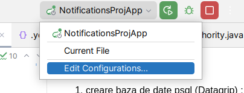
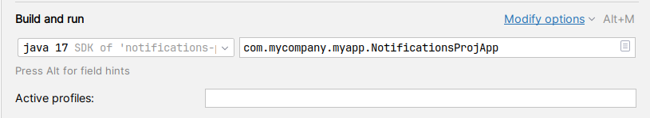
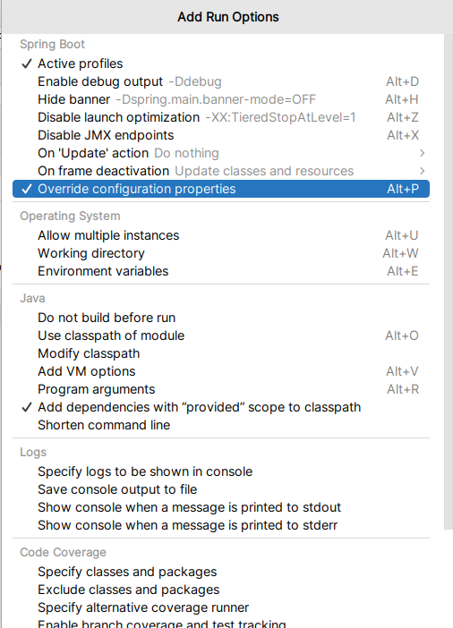
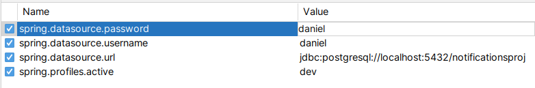

pasi pornire proiect :

1. creare baza de date psql (Datagrip) : notificationsproj
2. in intellij facem override la urmatoarele proprietati (schimbam password username cum e configurat local)

click modify options :

click

3. pornim backendul
4. deschidem terminal si executam

- npm install
- npm start

in browser in loc de 9000 folosim portul 4200

log file can be found :

{user.home}/spring-boot-logger.log
